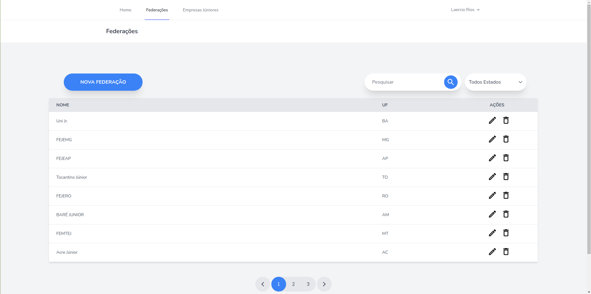

# Projeto Trainee Ecomp Jr.
<p align="center">Projeto desenvolvido como parte final do programa trainee da <a href="https://ecompjr.com.br/">Ecomp Jr.</a>.</p>

<!--ts-->
   * [Sobre](#sobre)
   * [Features](#features)
   * [Como usar](#como-usar)
      * [Pre Requisitos](#pre-requisitos)
      * [Rodando](#rodando)
   * [Tecnologias](#tecnologias-🛠)
<!--te-->

<h4 align="center"> 
	✨  Projeto Finalizado  ✨
</h4>

## Sobre

Projeto consiste em um portal para cadastro de empresa júniores e suas federações.
 

## Features

- Sistema de Login
- CRUD de Empresa Júnior
- CRUD de Federação

## Como Usar
### Pré Requisitos
Para rodar o projeto é preciso ter instalado o laravel, que pode ser encontrado [aqui](https://laravel.com/docs/).

Já para o banco de dados será necessário ter o MySQL Server instalado. Você pode encontrar [aqui](https://dev.mysql.com/downloads/mysql/).

### Rodando

**Clonando o repositório**

```
$ git clone https://github.com/LaercioSR/project-trainee-ecompjr

$ cd project-trainee-ecompjr
```

**Instalando dependências**

```
$ composer update
```

**Configurando o banco de dados**

Primeiramente você deve criar um database MySQL local para o projeto.

Copie o arquivo .env.example executando para linux ou mac:
```
$ cp .env.example .env
```
ou para windows:
```
$ copy .env.example .env
```
E altere as informações necessárias de banco de dados.

Depois é necessário gerar uma chave, para isso é só usar o comando:

```
$ php artisan key:generate
```


Rode os comandos abaixo para criar as tabelas já pré-definidas:
```
$ php artisan migrate

```
### Executando

Com as dependências instaladas e banco de dados configurado corretamente, agora você pode executar o sistema:

```
$ php artisan serve
```

E acessar a aplicação web por:
```
localhost:8000
```
## Tecnologias 🛠 

As seguintes ferramentas foram usadas na construção do projeto:
- [Laravel](https://laravel.com/)
- [Tailwind CSS](https://tailwindcss.com/)
